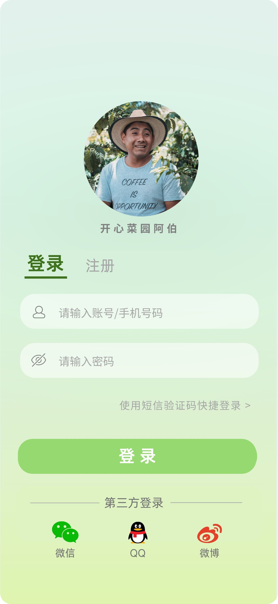
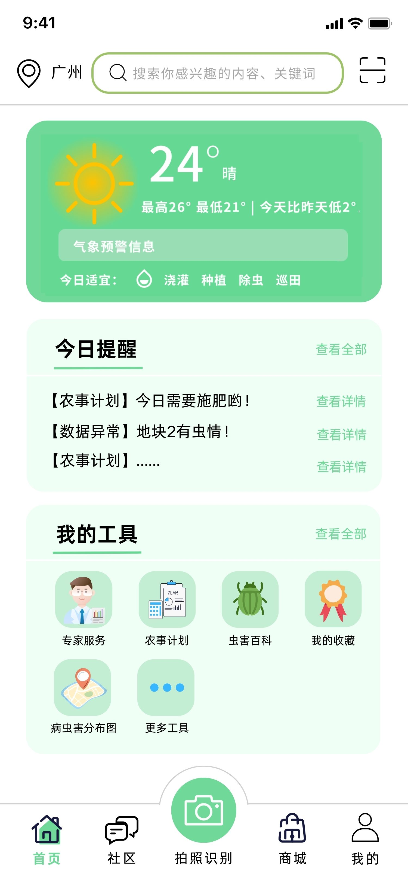
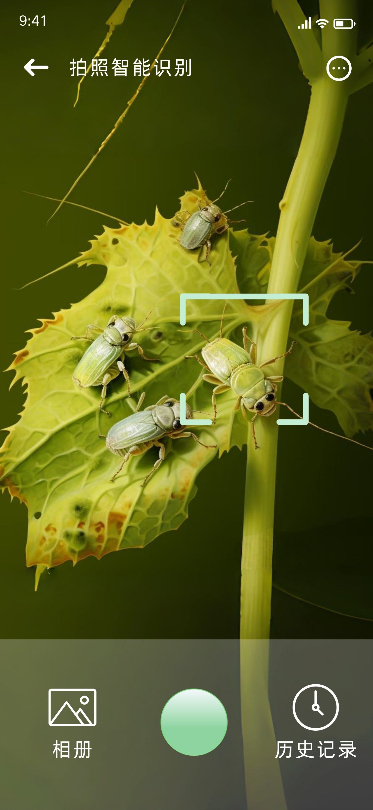
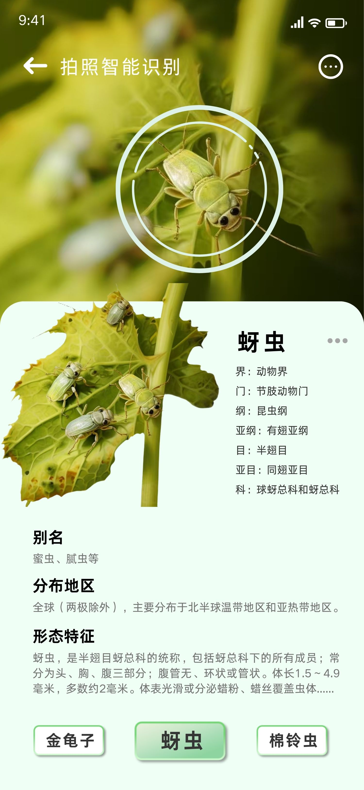
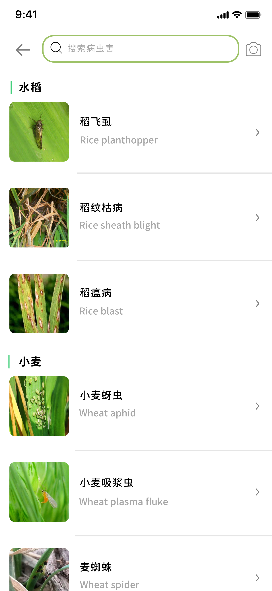
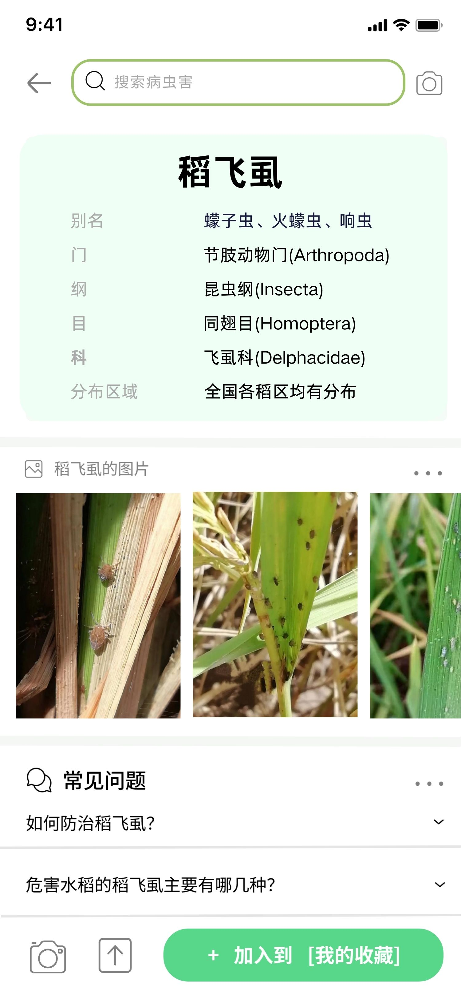
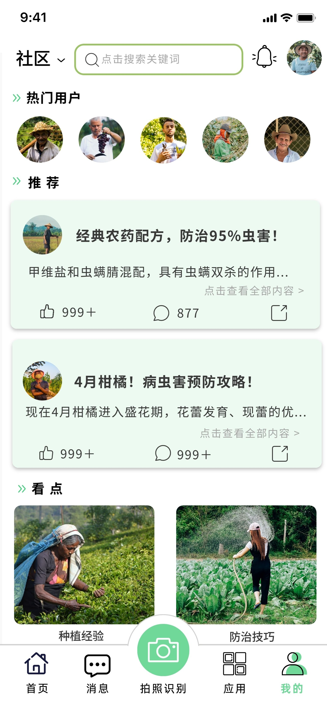
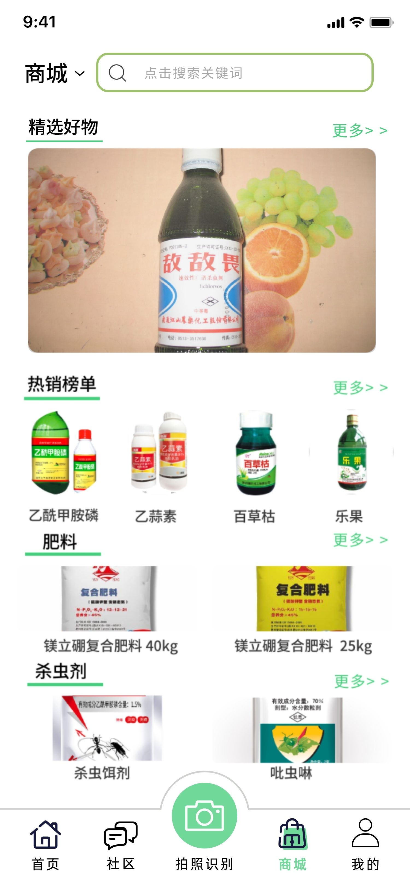
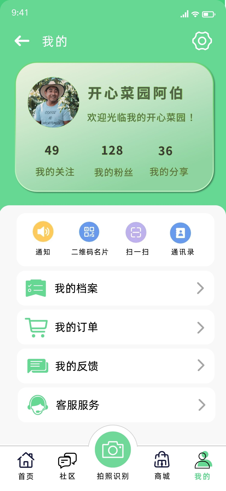
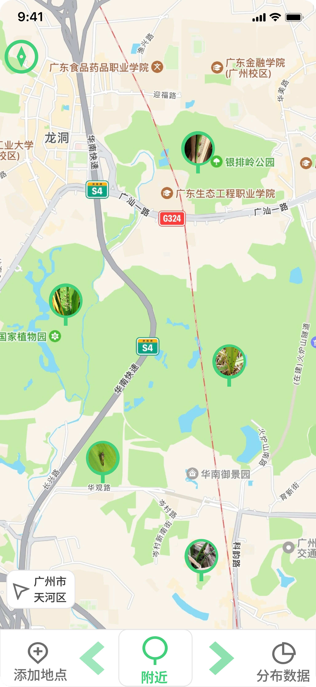

# Plant Doctor · 智农慧眼

[](https://www.python.org/)
[](https://kivy.org/)
[](https://fastapi.tiangolo.com/)
[](#)
[](LICENSE)

> 拍一张作物照片，立刻知道病虫害名称、置信度、症状简介与防治方案。

**Plant Doctor（智农慧眼，Windows 打包名“农智慧眼”）** 是一款面向农户的智慧农业病虫害识别应用：客户端基于 **Kivy** 开发，一套代码同时运行于 Windows 桌面与 Android 手机；识别能力由局域网内的 **FastAPI + ConvNeXt** 推理服务提供，照片不出局域网，兼顾隐私与速度。此外还集成了农资商城、种植社区、虫害百科、农事计划、病虫害分布图与天气提醒等功能。

---

## 目录

- [一、项目概述](#一项目概述)
  - [1.1 项目背景与意义](#11-项目背景与意义)
  - [1.2 核心功能](#12-核心功能)
  - [1.3 技术栈选型](#13-技术栈选型)
  - [1.4 适用场景与目标用户](#14-适用场景与目标用户)
- [二、项目结构说明](#二项目结构说明)
  - [2.1 目录树](#21-目录树)
  - [2.2 关键目录与文件](#22-关键目录与文件)
  - [2.3 代码组织原则](#23-代码组织原则)
- [三、快速启动指南](#三快速启动指南)
  - [3.1 环境要求](#31-环境要求)
  - [3.2 获取源码](#32-获取源码)
  - [3.3 启动识别服务端](#33-启动识别服务端)
  - [3.4 运行客户端](#34-运行客户端)
  - [3.5 配置说明](#35-配置说明)
  - [3.6 运行验证](#36-运行验证)
  - [3.7 构建与打包](#37-构建与打包)
- [四、功能演示](#四功能演示)
- [五、贡献指南](#五贡献指南)
  - [5.1 贡献流程](#51-贡献流程)
  - [5.2 代码风格](#52-代码风格)
  - [5.3 提交信息规范](#53-提交信息规范)
  - [5.4 测试要求](#54-测试要求)
  - [5.5 评审标准](#55-评审标准)
- [六、许可证](#六许可证)
- [附录 A：系统架构与识别接口](#附录-a系统架构与识别接口)
- [附录 B：识别模型与数据库](#附录-b识别模型与数据库)
- [附录 C：已知问题与注意事项](#附录-c已知问题与注意事项)
- [致谢](#致谢)

---

## 一、项目概述

### 1.1 项目背景与意义

病虫害是造成作物减产的主要原因之一，而普通农户普遍面临“**认不出、不会治、来不及问专家**”的困境。Plant Doctor 用手机拍照即可完成病虫害识别，并直接给出症状解释与用药、耕作建议，把“诊断—防治”闭环压缩到几秒钟：

- **降低使用门槛**：无需专业分类学知识，拍照即得结果，适合田间快速决策；
- **保护数据隐私**：模型部署在农户自己的电脑/局域网服务器上，照片不上传公网；
- **形成农业工具矩阵**：在识别之外提供百科、社区、商城、农事提醒等周边能力，覆盖“识、学、问、买”全链路。

### 1.2 核心功能

| 模块         | 源码位置                                             | 功能说明                                                                   |
| ------------ | ---------------------------------------------------- | -------------------------------------------------------------------------- |
| 登录 / 注册  | [`screens/auth.py`](screens/auth.py)                 | 用户名密码登录；注册可选头像与角色（免费用户 / VIP）                       |
| 首页         | [`screens/home.py`](screens/home.py)                 | 天气卡片、今日农事提醒、常用工具入口、病虫害搜索、底部导航                 |
| 拍照识别     | [`screens/camera.py`](screens/camera.py)             | 实时相机取景（Android 权限申请 + 竖屏预览）或从相册/本地选图，上传后端识别 |
| 识别结果     | [`screens/camera.py`](screens/camera.py)             | 病虫害中文名、置信度、症状简介、防治方法与 Top-5 候选                      |
| 社区         | [`screens/community.py`](screens/community.py)       | 帖子列表与详情、点赞、浏览计数、评论、种植经验/防治技巧文章                |
| 农资商城     | [`screens/store.py`](screens/store.py)               | 广告位与分区推荐、分类列表、商品搜索、收藏、下单、评论、农药详情           |
| 虫害百科     | [`screens/encyclopedia.py`](screens/encyclopedia.py) | 按作物分类的病虫害词条列表与详情（介绍 + 防治方法）                        |
| 农事计划     | [`screens/farming_plan.py`](screens/farming_plan.py) | 农事提醒与计划管理                                                         |
| 病虫害分布图 | [`screens/misc.py`](screens/misc.py)                 | 图片型虫情分布展示页                                                       |
| 个人中心     | [`screens/mypage.py`](screens/mypage.py)             | 头像/昵称/签名、我的收藏、我的订单                                         |

**免费额度策略**：免费用户每天可识别 **3 次**，VIP 用户不限次数，额度由 [`database/user_db.py`](database/user_db.py) 按日期计数控制。

### 1.3 技术栈选型

| 层级           | 技术                                                                | 版本 / 说明                                                            |
| -------------- | ------------------------------------------------------------------- | ---------------------------------------------------------------------- |
| 客户端 UI 框架 | [Kivy](https://kivy.org/)                                           | 2.3.0，跨平台 Python GUI，同一份代码运行 Windows / Android             |
| 客户端组件库   | [KivyMD](https://kivymd.app/)                                       | 1.2.0，提供 Material 风格控件（如日期选择器，缺失时自动降级）          |
| 图像处理       | Pillow                                                              | 10.3.0，头像裁剪、点赞图标染色等                                       |
| HTTP 客户端    | requests                                                            | 调用识别 API（已显式禁用系统代理，避免内网请求被代理拦截）             |
| 编程语言       | Python                                                              | 3.11+（开发与打包基于 3.11，3.12/3.13 亦可运行）                       |
| 后端框架       | [FastAPI](https://fastapi.tiangolo.com/) + Uvicorn                  | 提供 `POST /predict` 图片识别接口，默认监听 `0.0.0.0:8000`             |
| 表单解析       | python-multipart                                                    | FastAPI 接收 `multipart/form-data` 图片                                |
| 深度学习       | PyTorch + torchvision                                               | ConvNeXt-Base（替换 181 维分类头），CPU 推理 + 4 向翻转 TTA            |
| 数据库         | SQLite 3                                                            | 单文件库 `smart_agri.db`，首次运行自动建表并写入种子数据，无需独立部署 |
| 天气数据       | t.weather.itboy.net（主）/ [wttr.in](https://wttr.in/)（备）        | 免费天气接口，城市缓存于 `weather_city.json`                           |
| 服务发现       | UDP 广播                                                            | 客户端监听 `8765` 端口自动发现服务端（[`discovery.py`](discovery.py)） |
| Windows 打包   | [PyInstaller](https://pyinstaller.org/)                             | 配置文件 `main.spec`，产物 `农智慧眼.exe`                              |
| Android 打包   | [Buildozer](https://github.com/kivy/buildozer) / python-for-android | 配置文件 `buildozer.spec`，产物 debug/release APK                      |
| 开发工具       | pip + venv、Git                                                     | 依赖管理与版本控制                                                     |

### 1.4 适用场景与目标用户

- **目标用户**：种植农户、农业合作社、基层农技推广人员、农业院校师生；
- **典型场景**：
  1. 田间巡田时发现异常叶片，拍照即时确诊并获取施药建议；
  2. 种植新手通过虫害百科与社区文章学习识别与防治；
  3. 合作社在局域网内部署一个服务端，多台手机/电脑共享识别能力；
  4. 教学演示：作为“移动端 + 深度学习服务端 + SQLite”全栈课程设计案例。

---

## 二、项目结构说明

### 2.1 目录树

```text
PlantDoctor/
├── main.py                  # 程序入口：注册全部 Screen、全局状态与识别调度
├── config.py                # 常量与静态数据（API 地址、主题色、商品/词条/帖子种子数据）
├── utils.py                 # 工具函数与基类（中文字体、Toast、弹窗、头像裁剪、相机补丁、BaseScreen）
├── discovery.py             # 局域网 UDP:8765 广播监听，自动发现识别服务端
├── test_api.py              # 识别接口联调脚本（本地 /predict 冒烟测试）
├── opencv_test.py           # OpenCV 相机验证脚本
├── requirements.txt         # 客户端 Python 依赖
├── main.spec                # PyInstaller 打包配置（Windows exe）
├── buildozer.spec           # Buildozer 打包配置（Android APK）
├── weather_city.json        # 天气城市缓存（默认 shanghai）
├── smart_agri.db            # SQLite 数据库（运行时自动生成，已被 .gitignore 忽略）
│
├── ai_model/                # 识别服务端与模型训练
│   ├── api.py               # FastAPI 服务（加载模型、TTA 推理、/predict）*
│   ├── pest_model.pth       # 训练好的模型权重（约 335MB，不纳入 Git）
│   ├── classes.json         # 181 个类别英文名列表
│   ├── class_list.txt       # 类别清单与样本数量统计
│   ├── disease_info.json    # 病虫害中文名、简介、防治方法详情库
│   ├── train.py             # 训练脚本（ConvNeXt + 迁移学习 + 断点续训）
│   ├── preprocess_data.py   # 数据预处理：统一尺寸、清洗、按 8:2 划分 train/val
│   └── download_data.py     # 下载 PlantVillage 数据集
│
├── database/                # 数据访问层
│   ├── __init__.py
│   ├── user_db.py           # 用户注册/登录/资料更新/每日识别次数
│   └── store_db.py          # 商品、收藏、订单、社区、百科词条、种子数据版本控制
│
├── screens/                 # 页面层（每个页面一个 Screen 类）
│   ├── auth.py              #   登录 / 注册
│   ├── home.py              #   首页（天气、提醒、工具）
│   ├── camera.py            #   相机取景与识别结果页
│   ├── community.py         #   社区列表与帖子详情
│   ├── store.py             #   商城首页、分类、农药详情
│   ├── encyclopedia.py      #   百科列表与词条详情
│   ├── farming_plan.py      #   农事计划
│   ├── mypage.py            #   个人中心、收藏、订单
│   └── misc.py              #   病虫害分布图
│
├── widgets/                 # 通用 UI 组件
│   ├── base_widgets.py      # RoundedButton / CircleImage / IconButton / ToolCard …
│   └── product_widgets.py   # 商品列表行与商品横向滚动列表
│
├── src/android/             # Android 清单与 FileProvider 配置（Buildozer 引用）
├── image/                   # 应用图片资源（病虫害、农药、图标、文章配图）
├── avatars/                 # 内置头像资源
├── photos/                  # 运行时拍照/裁剪产物（仅保留 .keep）
└── UI/                      # 界面设计稿（README 功能演示引用）
```

> \* `ai_model/api.py` 依原作者要求不纳入公开仓库（见 [.gitignore](.gitignore)）；下文 [3.3 节](#33-启动识别服务端)给出的是其运行方式与接口契约，可据此实现等价服务。模型权重 `pest_model.pth` 因体积超过 GitHub 单文件 100MB 限制，同样不纳入 Git。

### 2.2 关键目录与文件

| 路径                                           | 职责                                                                                                                                                                     |
| ---------------------------------------------- | ------------------------------------------------------------------------------------------------------------------------------------------------------------------------ |
| [`main.py`](main.py)                           | 入口。`MyApp.build()` 创建并注册全部页面；`MyApp` 维护当前用户、相机模式、拍照菜单、后台线程识别请求、结果页跳转等全局能力                                               |
| [`config.py`](config.py)                       | 只放常量与静态数据，不含业务逻辑：`API_BASE_URL`、主题绿 `GREEN`、数据库/图片路径、商品/百科/社区种子数据，以及 `get_api_base_url()` / `set_api_base_url()` 地址缓存读写 |
| [`utils.py`](utils.py)                         | 跨模块公共能力：多平台中文字体注册、Toast、文字弹窗、评论内容清洗、方形头像裁剪、Android 平台与权限判断、OpenCV 相机兼容性补丁、带背景图的 `BaseScreen`                  |
| [`discovery.py`](discovery.py)                 | 在 UDP `8765` 端口监听服务端广播 JSON，命中后经回调写回 `api_url.txt`                                                                                                    |
| [`database/user_db.py`](database/user_db.py)   | `users` 表的增查改、登录校验、`can_recognize_today()` / `increase_recognize_count()` 每日额度                                                                            |
| [`database/store_db.py`](database/store_db.py) | 商品搜索、收藏、下单、评论；社区点赞/浏览/评论；百科词条查询；基于 `app_meta` 的种子数据版本控制                                                                         |
| [`screens/`](screens)                          | 表现层。每个文件对应一类页面，统一由 `main.py` 的 `ScreenManager` 注册、切换                                                                                             |
| [`widgets/`](widgets)                          | 可复用控件层，页面只负责组装与交互，不重复造基础控件                                                                                                                     |

### 2.3 代码组织原则

1. **分层清晰**：`screens`（表现层）→ `database`（数据访问层）→ `smart_agri.db`（存储）；网络与模型推理在独立的 `ai_model` 服务端，客户端只通过 HTTP 交互；
2. **集中配置**：所有常量、路径与静态种子数据收敛在 `config.py`，页面代码不硬编码；
3. **页面自治**：一个页面一个 `Screen` 子类，跨页面通信与全局状态（当前用户、识别结果）由 `MyApp` 统一调度；
4. **组件复用**：重复出现的按钮、头像、列表行下沉到 `widgets/`；
5. **平台隔离**：Android 专有逻辑（权限、文件选择器）通过 `utils.is_android()` 分支处理，保证 Windows 可直接运行。

---

## 三、快速启动指南

### 3.1 环境要求

| 项目              | 要求                                                                                         |
| ----------------- | -------------------------------------------------------------------------------------------- |
| 操作系统          | Windows 10/11（客户端开发、Windows 打包）；Android 打包需 Linux（推荐 Ubuntu 22.04 或 WSL2） |
| Python            | **3.11.x**（推荐，与打包环境一致；3.12/3.13 亦可运行开发模式）                               |
| pip               | ≥ 23.0（随 Python 自带，建议 `python -m pip install -U pip`）                                |
| 磁盘空间          | 客户端约 200MB；服务端含 PyTorch 与模型权重约 2.5GB                                          |
| 网络              | 客户端与服务端必须处于**同一局域网（同一 WiFi）**；天气功能需访问公网                        |
| Android（仅打包） | JDK 17、Android SDK（target API 33 / min API 24）、NDK 25b、Buildozer                        |
| 硬件              | 模型仅 CPU 推理，**无需显卡**；摄像头（拍照功能）                                            |

> Windows 官方 Python 安装包自带 `tkinter`（本地选图对话框依赖它），如使用精简版 Python 请确认已勾选 tcl/tk 组件。

### 3.2 获取源码

```bash
git clone https://github.com/<your-name>/PlantDoctor.git
cd PlantDoctor
```

建议在虚拟环境中开发：

```bash
# Windows (PowerShell)
python -m venv .venv
.\.venv\Scripts\Activate.ps1

# Linux / macOS / WSL2
python3 -m venv .venv
source .venv/bin/activate
```

**下载缓慢时可使用国内镜像或代理**：

```bash
# 临时指定清华镜像
python -m pip install -r requirements.txt -i https://pypi.tuna.tsinghua.edu.cn/simple

# 如处于公司代理网络，显式指定代理
python -m pip install -r requirements.txt --proxy http://127.0.0.1:7890
```

> 注意：以上代理配置只影响 **pip 下载**。应用运行时对识别服务的请求已通过 `session.trust_env = False` 显式绕过系统代理，Clash / Charles 等不会干扰局域网调用。

### 3.3 启动识别服务端

识别服务基于 FastAPI + PyTorch（`ai_model/api.py`，未包含在公开仓库中，需从作者处获取或按 [附录 A](#附录-a系统架构与识别接口) 的接口契约自行实现）。

```bash
cd ai_model
python -m pip install torch torchvision fastapi "uvicorn[standard]" pillow python-multipart requests
python api.py
```

启动成功时控制台依次打印：

```text
加载病虫害识别模型...
模型加载成功，可识别 181 类病虫害，其中昆虫 100 类、作物病害 81 类
已加载 xx 条病虫害详情
==================================================
启动病虫害识别 API
INFO:     Uvicorn running on http://0.0.0.0:8000
```

服务监听 `0.0.0.0:8000`：

- 本机访问：`http://127.0.0.1:8000`
- 手机访问：使用电脑的局域网 IP，如 `http://192.168.0.101:8000`（可用 `ipconfig` / `ip addr` 查看）

### 3.4 运行客户端

新开一个终端：

```bash
# 回到项目根目录
pip install -r requirements.txt
python main.py
```

如需使用 Windows 相机预览，另装 OpenCV 相机驱动：

```bash
pip install opencv-python
```

预期现象：

- Windows 下弹出 **360 × 800** 的竖屏窗口（模拟手机比例）；
- 出现“正在搜索服务器...”提示，随后进入登录页；
- 程序启动时会自动创建 `photos/` 目录，首次使用登录后生成 `smart_agri.db`。

**测试账号**（开发库内置）：

| 账号   | 密码  | 角色                      |
| ------ | ----- | ------------------------- |
| `zmh`  | `123` | 普通用户（每天 3 次识别） |
| `zmh2` | `123` | VIP（不限次数）           |

### 3.5 配置说明

#### 环境变量

| 变量名          | 作用                                        | 默认值                      |
| --------------- | ------------------------------------------- | --------------------------- |
| `PLANT_API_URL` | 识别服务默认地址，在 `config.py` 导入时读取 | `http://192.168.0.101:8000` |

设置示例：

```powershell
# Windows PowerShell（当前会话生效）
$env:PLANT_API_URL = "http://192.168.1.50:8000"
python main.py
```

```bash
# Linux / macOS
PLANT_API_URL=http://192.168.1.50:8000 python main.py
```

#### 配置文件

| 文件                | 含义                                                                             | 是否纳入 Git   |
| ------------------- | -------------------------------------------------------------------------------- | -------------- |
| `api_url.txt`       | 运行时缓存的服务端地址（自动发现或连通性探测回退后写入）                         | 否（机器相关） |
| `weather_city.json` | 首页天气城市，默认 `shanghai`，首页切换城市后自动写回                            | 是             |
| `config.py`         | 主题色 `GREEN`、`API_BASE_URL`、资源路径、`STORE_CATALOG_VERSION` 种子数据版本等 | 是             |

服务地址的**实际解析顺序**（见 [`config.py`](config.py) 与 [`main.py`](main.py) 的 `_resolve_api_base()`）：

1. `api_url.txt` 中的缓存地址；
2. 环境变量 `PLANT_API_URL`（导入时写入 `API_BASE_URL`）；
3. `config.py` 中的默认 `API_BASE_URL`；
4. 发起识别前还会依次探测缓存地址、`http://127.0.0.1:8000`、`http://localhost:8000`，首个连通地址会被写回缓存。

自动发现：客户端启动后在 UDP `8765` 监听 5 秒，服务端广播如下 JSON 即自动连接。当前服务端未内置广播逻辑，超时后静默回退到上述配置：

```json
{ "service": "nongzhi_api", "ip": "192.168.0.101", "port": 8000 }
```

### 3.6 运行验证

1. **服务端健康检查**——浏览器或 curl 访问根地址：

   ```bash
   curl http://127.0.0.1:8000/
   ```

   预期返回：

   ```json
   { "message": "病虫害识别 API 已启动" }
   ```

2. **识别接口冒烟测试**——仓库自带联调脚本，默认请求一张内置图片：

   ```bash
   python test_api.py
   ```

   预期输出 `✅ 识别成功` 及包含 `pest_name`、`confidence` 的 JSON。

3. **客户端功能验证**：
   - 使用 `zmh / 123` 登录 → 进入首页，天气卡正常显示温度与天气描述；
   - 点击底部中央相机按钮 → 选择“使用照片” → 选取 `image/pest_玉米大斑病.png`；
   - 弹出“识别中，请稍候...”→ 跳转结果页，显示病虫害名称、置信度与防治方法；
   - 连续识别第 4 次时应提示“免费用户每天限识别 3 次”；
   - 依次切换底部导航：社区、商城、我的，页面均可正常打开。

### 3.7 构建与打包

**Windows 可执行文件**（开发机调试用“生产模式”产物）：

```bash
pip install pyinstaller
python -m PyInstaller main.spec
# 产物：dist/农智慧眼/农智慧眼.exe
```

`main.spec` 已把 `image/`、`avatars/`、`database/`、`screens/`、`widgets/`、`config.py`、`utils.py`、`smart_agri.db` 一并打入；`build/`、`dist/` 已在 `.gitignore` 中忽略。

**Android APK**（需 Linux / WSL2）：

```bash
pip install buildozer cython
sudo apt update && sudo apt install -y openjdk-17-jdk zip unzip autoconf libtool pkg-config zlib1g-dev
buildozer -v android debug
# 产物：bin/plantdoctor-1.0.0-debug.apk
```

`buildozer.spec` 关键配置：竖屏、`INTERNET / CAMERA / READ_EXTERNAL_STORAGE / READ_MEDIA_IMAGES` 权限、`arm64-v8a + armeabi-v7a`、target API 33、min API 24、NDK 25b；`ai_model/`、`photos/` 与模型权重已排除，模型不随 APK 分发。

---

## 四、功能演示

> 以下为各模块的**界面设计稿**（存放在 [`UI/`](UI/) 目录），实际运行界面与之保持一致的布局与交互。

### 登录 / 注册



账号密码登录，支持注册时选择头像与角色（免费 / VIP），并预留短信验证码与第三方登录入口。

### 首页



顶部城市定位与病虫害搜索；天气卡展示实时温度、高低温和今日适宜农事；中部为今日提醒与“我的工具”（专家服务、农事计划、虫害百科、我的收藏、病虫害分布图）；底部为五栏导航。

### 拍照识别



竖屏实时取景，支持相册选图与历史记录；Android 端首次使用会申请相机与存储权限。

### 识别结果



展示命中对象、分类学信息、别名、分布与形态特征，并在置信度低于 50% 时提示“结果仅供参考”，同时给出 Top-5 候选。

### 虫害百科

|        百科列表        |       百科详情        |
| :--------------------: | :-------------------: |
|  |  |

按水稻、小麦、玉米、番茄等作物分组浏览，支持关键词搜索；详情页包含分类信息、图集、常见问题与一键收藏。

### 种植社区



热门用户、推荐帖子（点赞 / 评论 / 转发）与“种植经验、防治技巧”看点文章；点进帖子可查看全文并评论。

### 农资商城



精选好物广告位、热销榜单、肥料与杀虫剂分区；支持搜索、收藏、下单与商品评论，点击农药可查看用法用量与注意事项。

### 个人中心



头像、昵称与签名维护，我的档案、我的订单、我的反馈、客服服务等入口，以及关注 / 粉丝 / 分享统计。

### 病虫害分布图



以地图形式展示区域虫情上报点，辅助判断周边病虫害发生趋势。

### 专家咨询（设计稿）


预留的一对一农技专家图文咨询界面（当前版本未在客户端注册该页面，属于规划功能）。

---

## 五、贡献指南

欢迎提交 Issue 与 Pull Request！请遵循以下约定，以便你的贡献被高效评审与合入。

### 5.1 贡献流程

1. **Fork 仓库**：点击 GitHub 右上角 Fork，然后克隆你的 Fork：

   ```bash
   git clone https://github.com/<your-account>/PlantDoctor.git
   cd PlantDoctor
   git remote add upstream https://github.com/<owner>/PlantDoctor.git
   ```

2. **新建分支**：不要直接在 `main` 上开发，分支名使用 `类型/简述`：

   ```bash
   git checkout -b feat/add-weather-alert
   # 常用类型：feat / fix / docs / refactor / test / chore
   ```

3. **开发与自测**：按 [5.4 测试要求](#54-测试要求) 完成自测。

4. **提交并推送**：

   ```bash
   git add <改动的文件>
   git commit -m "feat(home): 新增天气预警横幅"
   git push origin feat/add-weather-alert
   ```

5. **发起 Pull Request**：在 GitHub 上向主仓库 `main` 分支发起 PR，PR 描述需包含**改动内容、动机、自测方式、截图（UI 变更时）**，并关联相关 Issue（如 `Closes #12`）。

### 5.2 代码风格

- 遵循 **[PEP 8](https://peps.python.org/pep-0008/)**：4 空格缩进、UTF-8 编码、模块级变量使用 `UPPER_SNAKE_CASE`；
- 关键函数与复杂分支需写 docstring 或行内注释，解释“为什么”而不是“做什么”；
- UI 文案可直接使用中文，技术标识符（变量、类、函数）使用英文；
- 新常量与种子数据放入 [`config.py`](config.py)，不要在页面内硬编码；
- 新页面请在 [`main.py`](main.py) 的 `ScreenManager` 中注册，并复用 [`widgets/`](widgets/) 中的基础控件；
- 不要提交密钥、个人绝对路径、`build/`、`dist/`、`*.db`、`api_url.txt`、`__pycache__/` 等产物（[.gitignore](.gitignore) 已配置）；
- 涉及网络请求时保持“局域网直连、绕过系统代理”的现有策略。

### 5.3 提交信息规范

采用 [Conventional Commits](https://www.conventionalcommits.org/) 格式：

```text
<type>(<scope>): <subject>

<optional body>
```

- `type`：`feat`（新功能）、`fix`（缺陷修复）、`docs`（文档）、`style`（格式）、`refactor`（重构）、`test`（测试）、`chore`（构建/杂项）；
- `scope`：可选，如 `home`、`camera`、`store`、`api`、`db`；
- `subject`：简明扼要，建议不超过 50 字；
- 示例：

  ```text
  feat(camera): 识别结果页支持查看 Top-5 候选
  fix(store): 修复库存为 0 时仍可下单的问题
  docs(readme): 补充 Android 打包前置依赖
  ```

### 5.4 测试要求

- **服务端改动**：启动 `ai_model/api.py`，运行 `python test_api.py` 确认 `✅ 识别成功`，并用一张健康叶片与一张病叶分别验证；
- **客户端改动**：运行 `python main.py` 完成冒烟流程——登录 → 首页 → 拍照/选图识别 → 结果页 → 社区/商城/我的；
- **相机相关改动**：Windows 下运行 `python opencv_test.py` 验证取流；如有条件在 Android 真机验证权限申请流程；
- **数据库改动**：删除（或重命名）`smart_agri.db` 后重新启动，确认自动建表与种子数据写入正常；
- 项目暂无自动化单元测试，如新增数据处理/模型逻辑，建议补充对应的 `test_*.py` 脚本。

### 5.5 评审标准

PR 至少满足以下条件才会合入：

1. 功能与描述一致，核心流程自测通过；
2. 不破坏 Windows 开发模式与 Android 打包配置；
3. 符合 5.2 代码风格，提交信息符合 5.3 规范；
4. 不包含构建产物、个人信息、密钥与大体积二进制；
5. 用户可见行为变化已同步更新 README / 注释；
6. 评审意见解决并通过至少一位维护者 Approve。

---

## 六、许可证

本项目基于 **[MIT License](LICENSE)** 开源。任何人都可在保留版权声明与许可声明的前提下自由使用、复制、修改、合并、发布、再许可与销售本软件的副本。

完整许可证文本见仓库根目录的 [LICENSE](LICENSE) 文件。

> 说明：[`image/`](image/)、[`avatars/`](avatars/)、[`UI/`](UI/) 中的图像素材可能来自第三方，版权归原作者所有，仅用于学习与演示，商用请自行取得授权。

---

## 附录 A：系统架构与识别接口

### 架构总览

```text
┌──────────────────── 客户端（Windows / Android，Kivy） ────────────────────┐
│  main.py   · MyApp / ScreenManager（全局状态与页面跳转）                    │
│  screens/* · 登录 → 首页 → 相机 → 结果 / 社区 / 商城 / 百科 / 个人中心       │
│  database/*· SQLite 本地库 smart_agri.db（用户、商品、订单、社区、词条）     │
│  discovery.py · UDP:8765 监听服务端广播，命中后缓存地址到 api_url.txt       │
└──────────────────────────────────┬────────────────────────────────────────┘
                                   │  HTTP multipart  POST /predict
┌──────────────────────────────────▼────────────────────────────────────────┐
│  ai_model/api.py · FastAPI，默认监听 0.0.0.0:8000                           │
│  ConvNeXt-Base（181 类分类头）· CPU 推理 · 4 向翻转 TTA · Top-5 + 防治建议  │
└───────────────────────────────────────────────────────────────────────────┘
```

设计要点：**前后端分离**（换模型不必发版 APP）、**服务地址自动发现 + 多级回退**、**单文件 SQLite 零部署**。

### `GET /`

健康检查，返回 `{"message": "病虫害识别 API 已启动"}`。

### `POST /predict`

- 请求：`multipart/form-data`，字段名 `file`，值为图片文件；
- 成功响应示例：

  ```json
  {
    "success": true,
    "pest_name": "番茄疫病",
    "confidence": 96.42,
    "intro": "番茄疫病包含早疫病与晚疫病……",
    "treatment": { "medicine": "-", "dosage": "-", "method": "农业防治：……" },
    "treatment_text": "农业防治：……",
    "raw_class": "Tomato_Blight",
    "top5": [
      {
        "chinese_name": "番茄疫病",
        "raw_class": "Tomato_Blight",
        "confidence": 96.42
      }
    ],
    "low_confidence": false,
    "warning": ""
  }
  ```

| 字段                           | 说明                                  |
| ------------------------------ | ------------------------------------- |
| `pest_name`                    | 命中病虫害中文名                      |
| `confidence`                   | 置信度百分比（0–100）                 |
| `intro`                        | 症状简介                              |
| `treatment` / `treatment_text` | 防治建议（`method` 为完整防治文本）   |
| `raw_class`                    | 模型原始类别英文名                    |
| `top5`                         | TTA 平均后的 Top-5 备选               |
| `low_confidence` / `warning`   | 置信度低于 50% 时为 `true` 并给出提示 |

失败时返回 `{"success": false, "error": "..."}`。

---

## 附录 B：识别模型与数据库

### 模型概况

- 骨干网络：`torchvision.models.convnext_base`，仅将分类头替换为 181 维；
- 类别总数 **181**：昆虫 **100** 类 + 作物病害 **81** 类（见 `ai_model/class_list.txt`）；
- 数据集规模：**220 899** 张图片，训练集 176 653 张（80%）/ 验证集 44 246 张（20%）。

### 训练策略（`ai_model/train.py`）

ConvNeXt + ImageNet-1K 迁移学习；交叉熵上叠加参数偏移 L2 正则（`lambda_cons=0.01`）抑制灾难性遗忘；增强链为 Resize(256) → RandomCrop(224) → 翻转 → 旋转 → ColorJitter → RandomErasing；`CrossEntropyLoss(label_smoothing=0.1)` + `AdamW(2e-4)` + 余弦退火；batch 32、最多 100 轮、早停耐心值 15，目标准确率 92.6%；支持断点续训并导出 `pest_model.pth` / `classes.json`。

### 推理流程（`ai_model/api.py`）

Resize(256) + CenterCrop(224) + ImageNet 归一化 → 原图/水平翻转/垂直翻转/双向翻转 4 个变体分别推理 → 按类别合并概率取平均 → 取 Top-5 → 经 `disease_info.json` 与内置 `ALIASES` 映射中文名与防治方案。

### 复现训练

```bash
cd ai_model
python download_data.py      # 下载 PlantVillage 彩色数据集（约 1GB）
python preprocess_data.py    # 统一尺寸、清洗、8:2 划分
python train.py              # 训练并导出 pest_model.pth / classes.json
```

> 脚本中的路径为原作者环境（Kaggle / 本机绝对路径），复现前请按自己的目录调整。

### 数据库表

| 表                     | 用途                                                         |
| ---------------------- | ------------------------------------------------------------ |
| `users`                | 账号、角色（free/vip）、头像、昵称、签名、每日识别次数与日期 |
| `store_products`       | 商品（分类、规格、价格、库存、热销/精选标记）                |
| `store_favorites`      | 商品收藏（用户名 + 商品 ID 联合主键）                        |
| `store_comments`       | 商品评论                                                     |
| `store_orders`         | 订单                                                         |
| `community_likes`      | 帖子点赞去重                                                 |
| `community_post_stats` | 帖子浏览量                                                   |
| `community_comments`   | 帖子评论                                                     |
| `pest_entries`         | 病虫害百科词条                                               |
| `user_pest_reports`    | 用户病虫害上报记录                                           |
| `app_meta`             | 应用元信息与种子数据版本号                                   |

`config.STORE_CATALOG_VERSION` 变更后，`store_db.py` 会按版本号自动重刷种子数据。

---

## 附录 C：已知问题与注意事项

1. **商品详情页未注册**：`screens/store.py` 中的 `ProductDetailScreen` 仍为占位实现且未注册到 `ScreenManager`，当前可正常使用的是农药详情（`PesticideDetailScreen`）；
2. **自动发现默认不可用**：服务端 `api.py` 未实现 UDP 广播，客户端等待 5 秒后回退到 `api_url.txt` 或默认地址，属预期行为；
3. **必须同一局域网**：手机与电脑不在同一 WiFi，或防火墙拦截 8000 端口时识别会失败，请在 Windows 防火墙放行 Python；
4. **模型权重不随仓库/APK 分发**：`pest_model.pth`（约 335MB）需单独获取，Android 端必须联网访问服务端识别；
5. **OpenCV 相机兼容**：旧版 Kivy 的 `camera_opencv.py` 曾被手动修改，`utils.patch_opencv_camera()` 已内置对 Kivy 2.3.0 + OpenCV 5.x 的兼容处理，升级 Kivy 后需重新验证；
6. **运行时文件勿提交**：`api_url.txt`、`smart_agri.db`、`photos/` 下的拍照产物均为本地状态，已在 `.gitignore` 忽略。

---

## 致谢

- [Kivy](https://kivy.org/) —— 跨平台 Python GUI 框架；
- [KivyMD](https://kivymd.app/) —— Material Design 组件；
- [PyTorch / torchvision](https://pytorch.org/) —— ConvNeXt 模型与训练；
- [FastAPI](https://fastapi.tiangolo.com/) —— 识别服务框架；
- [PlantVillage Dataset](https://github.com/spMohanty/PlantVillage-Dataset) —— 作物病害图像数据；
- [wttr.in](https://wttr.in/) 与 t.weather.itboy.net —— 免费天气接口。
